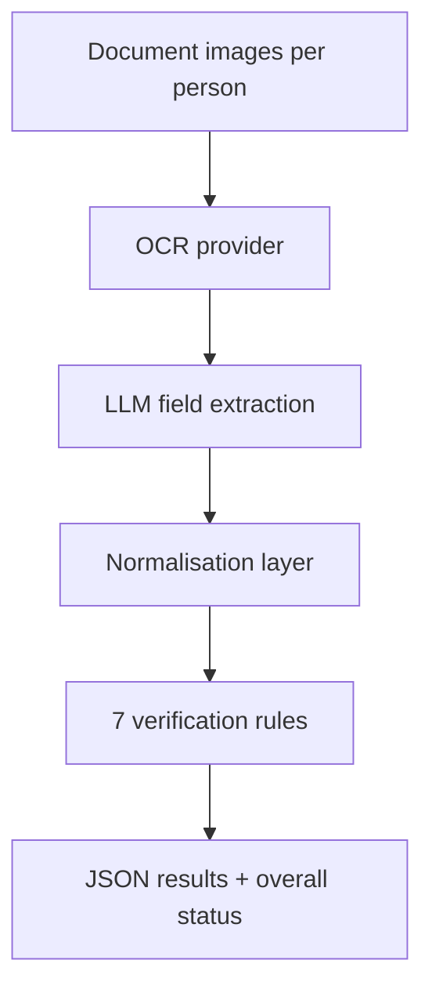

# AI KYC Document Verification

Batch KYC pipeline that OCRs government IDs and supporting documents, structures fields with an LLM, normalises messy values, and runs cross-document verification rules.

## Problem

Manual KYC checks across Aadhaar/PAN-style IDs, bank statements, and employment letters are slow and inconsistent. OCR noise (O/0, date formats, phone formatting) breaks naive string equality. This project automates extraction and applies a fixed rule set so reviewers see clear PASS/FAIL outcomes per person.

## Features

- Multi-provider OCR: Azure Computer Vision or Google Cloud Vision
- LLM structuring via OpenAI GPT-4 or Anthropic Claude
- Optional OpenCV/Pillow preprocessing for weak scans
- Normalisers for dates, phones, addresses, and case folding
- Seven verification rules (name, DOB, address, phone, father’s name, PAN format, Aadhaar format)
- Dataset runner that writes `verification_results.json`
- CLI flags for provider choice, preprocessing, and report generation
- Unit-style helpers in `test_system.py` for normalisers and rules

## Architecture



Application code lives under `document-verification-system/`.

## Tech stack

| Layer | Choice |
|---|---|
| Language | Python 3.8+ |
| OCR | Azure Computer Vision / Google Cloud Vision / optional Tesseract |
| LLM | OpenAI / Anthropic |
| Imaging | OpenCV, Pillow, pdf2image |
| Config | python-dotenv |

## Key engineering decisions

1. **OCR then LLM, not LLM-only vision.** Dedicated OCR keeps text extraction controllable; the LLM focuses on schema mapping and light error correction.
2. **Rules are deterministic.** Format checks (PAN/Aadhaar) and normalised equality are code, not another model call — cheaper and auditable.
3. **Provider swappable at the CLI.** `--ocr-provider` / `--llm-model` let you compare cost and quality without rewriting the pipeline.
4. **Fail soft on missing fields.** Partial documents produce rule-level FAIL/incomplete signals rather than crashing the batch.

Honest note on metrics: older copy claimed “95%+ accuracy” and fixed dollar costs without a published evaluation harness in-repo. Treat quality as dataset- and scan-quality dependent; measure on your own labelled set before quoting numbers.

## Getting started

### Prerequisites

- Python 3.8+
- OCR credentials (Azure and/or Google)
- LLM API key (OpenAI and/or Anthropic)

### Setup

```bash
git clone https://github.com/darkNIGHT669/ai-kyc-document-verification.git
cd ai-kyc-document-verification/document-verification-system
python -m venv venv
source venv/bin/activate
pip install -r requirements.txt
cp .env.example .env
```

Environment variable names (see `.env.example`):

```
AZURE_VISION_ENDPOINT=
AZURE_VISION_KEY=
OPENAI_API_KEY=
# plus Google / Anthropic vars if you select those providers
```

Place person folders under `dataset/` (sample layout included). Then:

```bash
python run.py
# optional:
python run.py --preprocess --generate-report
python test_system.py
```

Results write to `verification_results.json`. A Loom walkthrough may be linked from prior assignment materials.

## Project structure

```
ai-kyc-document-verification/
└── document-verification-system/
    ├── document_verification.py   # orchestration
    ├── image_preprocessing.py
    ├── run.py
    ├── test_system.py
    ├── requirements.txt
    ├── .env.example
    └── dataset/                   # per-person document images
```

## Testing / quality

```bash
python test_system.py
```

Covers normalisers, rule helpers, and JSON shape checks. This is not a full pytest suite with coverage gates.

## License

No `LICENSE` file is present in the repository root at the time of this rewrite. Add one explicitly before public redistribution.
